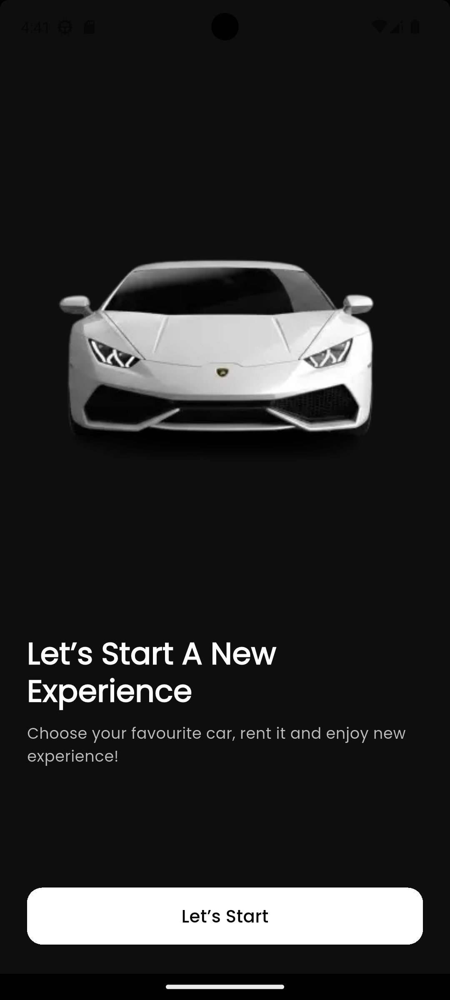
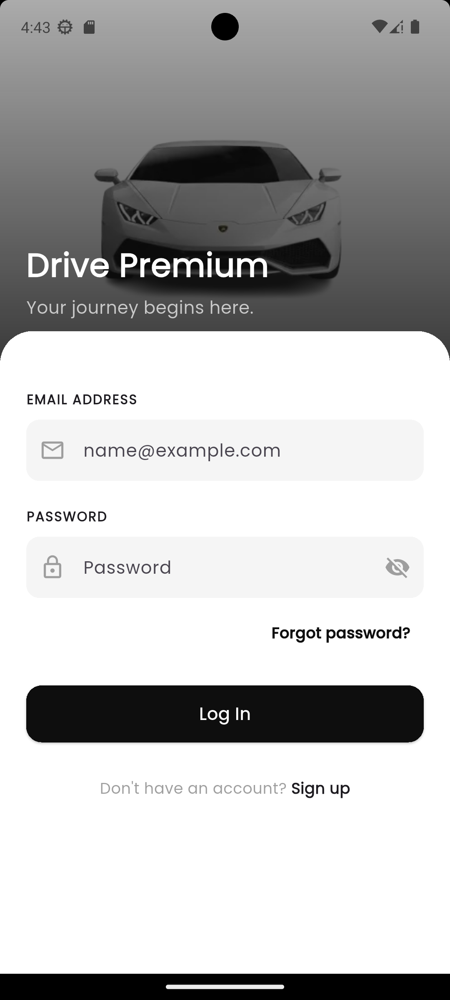
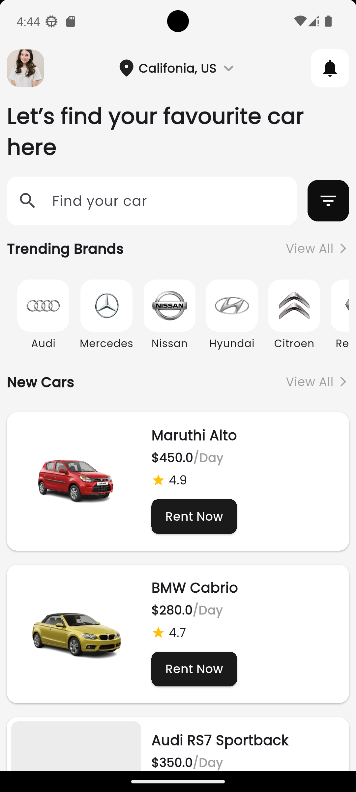
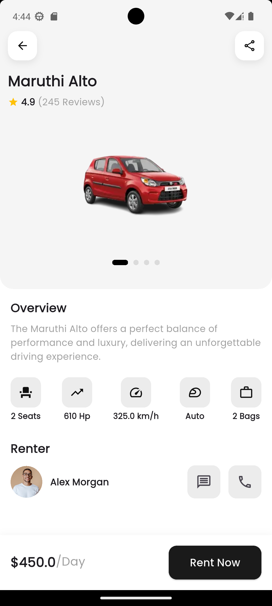
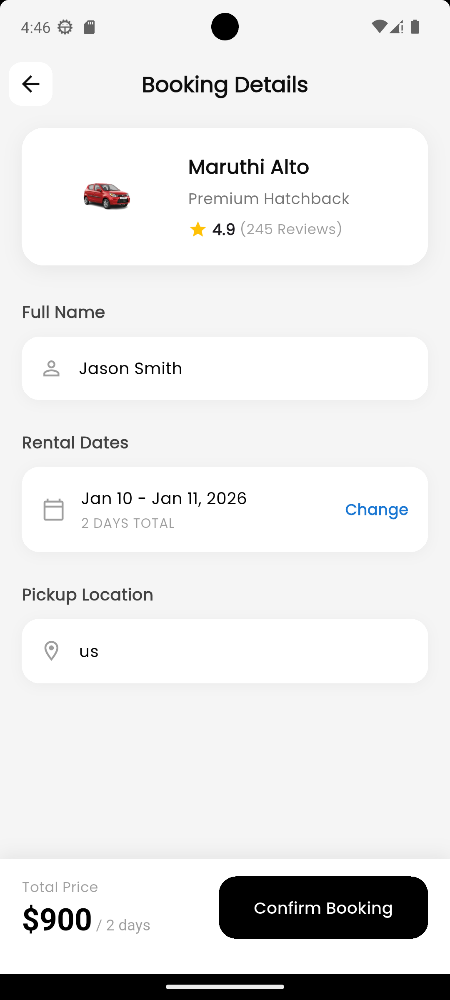
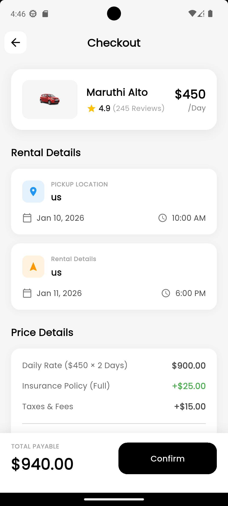

Car Rental App (Flutter)

A modern Car Rental mobile application built using Flutter and Provider for state management.
The app allows users to browse cars, select rental dates, calculate pricing dynamically, and confirm bookings with a clean and intuitive UI.

✨ Features

🔐 Login Screen

Form validation

Temporary login credentials

Loading state & snackbars

🚘 Car Details

Car images & specifications

Owner information

📅 Booking Form

Date selection (start & end date)

Dynamic rental price calculation

Pickup location selection

💳 Checkout / Confirmation

Rental summary

Price breakdown

Final confirmation

🎨 Modern UI

Clean layout

Consistent colors & spacing

Responsive design

🛠 Tech Stack

Flutter

Dart

Provider (State Management)

Material UI

🔑 Temporary Login Credentials

Use the following credentials to log in:

Email: car@gmail.com
Password: 123

📸 Screenshots
Login	Booking	Checkout

	
	

📌 Screenshots are stored inside the screenshots/ folder.

  
  
  

  
  
  

🚀 How to Run the App
1️⃣ Clone the repository
git clone https://github.com/your-username/car_rental.git
cd car_rental

2️⃣ Install dependencies
flutter pub get

3️⃣ Run the app
flutter run

Make sure:

Flutter SDK is installed

An emulator or physical device is connected

📂 Project Structure (Simplified)
assets/
├── images/
└── screenshots/

lib/
├── core/
│   ├── constants/
│   └── theme/
│
├── features/
│   ├── login/
│   │   ├── view/
│   │   ├── controller/
│   │   ├── model/
│   │   └── widgets/
│   │
│   ├── home/
│   │   ├── view/
│   │   ├── controller/
│   │   ├── model/
│   │   └── widgets/
│   │
│   ├── bookingForm/
│   │   ├── view/
│   │   ├── controller/
│   │   ├── model/
│   │   └── widgets/
│   │
│   ├── confirmPage/
│   │   ├── view/
│   │   ├── controller/
│   │   ├── model/
│   │   └── widgets/
│   │
│   ├── common/
│   │   ├── auth/
│   │   └── intro/
│   │
│   └── shared/
│       └── model/
│
└── main.dart

📌 Notes

This project currently uses temporary authentication logic

Backend integration can be added later (Firebase / REST API)

Built with scalability and clean architecture in mind

👨‍💻 Author

Shihad
Flutter Developer
📱 Passionate about building clean & scalable mobile apps